# HormuzChain — Monitoramento Marítimo e Blockchain Distribuída

O **HormuzChain** é uma evolução do sistema **HormuzNet**, transformando uma malha cooperativa descentralizada de monitoramento do Estreito de Ormuz em um sistema unificado que inclui **Economia Criptográfica**, **Auditoria de Missões** e **Pagamentos de Escoltas** rodando em uma blockchain proprietária.

Optamos por desenvolver todo o sistema em **Go 1.23** do zero, sem o uso de middlewares ou frameworks comerciais (como Ethereum ou Fabric) e sem bancos de dados tradicionais. Isso foi feito para garantir uma arquitetura extremamente leve (capaz de rodar múltiplos nós na mesma máquina) e demonstrar controle absoluto sobre algoritmos de consenso, concorrência e rede P2P. O sistema utiliza comunicação nativa via **UDP Multicast**, **TCP**, **WebSockets** e um consenso **Proof of Authority (PoA)** construído sob medida.

---

## Arquitetura do Sistema

```mermaid
graph TB
    subgraph SENSORS["🛰️ Camada de Sensores (UDP Multicast)"]
        S1[Sensor Setor 1]
        S2[Sensor Setor 2]
        S3[Sensor Setor 3]
        S4[Sensor Setor 4]
    end

    subgraph POA["⛓️ Rede P2P — Brokers Validadores (PoA Round-Robin)"]
        direction LR
        B1["🖥️ Broker B1\nLedger chain_1.json"]
        B2["🖥️ Broker B2\nLedger chain_2.json"]
        B3["🖥️ Broker B3\nLedger chain_3.json"]
        B4["🖥️ Broker B4\nLedger chain_4.json"]

        B1 <-->|"Gossip TCP\n+ Heartbeat"| B2
        B2 <-->|"Gossip TCP\n+ Heartbeat"| B3
        B3 <-->|"Gossip TCP\n+ Heartbeat"| B4
        B4 <-->|"Gossip TCP\n+ Heartbeat"| B1
        B1 <-->|"Gossip TCP"| B3
        B2 <-->|"Gossip TCP"| B4
    end

    subgraph CONSENSUS["🗳️ Consenso PoA (por ciclo de bloco ~10s)"]
        direction LR
        P["Proponente\n(N mod 4)"]
        Q["Quórum 3/4\nAssinaturas ECDSA"]
        C["Commit\nFinalidade Imediata"]
        P --> Q --> C
    end

    subgraph LEDGER["📒 Blockchain Compartilhada (4 réplicas)"]
        G["Bloco Gênese\n(Mints ELIS)"]
        BK1["Bloco N"]
        BK2["Bloco N+1"]
        BK3["Bloco N+2"]
        G --> BK1 --> BK2 --> BK3
    end

    subgraph AGENTS["🚢 Agentes Autônomos"]
        V1["Navio V1\nCarteira ECDSA"]
        V2["Navio V2\nCarteira ECDSA"]
        D1["🚁 Drone D1"]
        D2["🚁 Drone D2"]
        D3["🚁 Drone D3"]
        D4["🚁 Drone D4"]
    end

    subgraph MONITOR["🖥️ Monitor & Explorer (WebSocket + REST)"]
        MW["Painel Tático\nlocalhost:8085"]
        EX["Blockchain Explorer\n🔒 Auditoria PIN 1234"]
    end

    subgraph MUTEX["🔒 Exclusão Mútua Distribuída"]
        LM["Algoritmo de Lamport\n(despacho de drones)"]
    end

    %% Fluxo de detecção
    S1 & S2 & S3 & S4 -->|"Alerta UDP Multicast"| B1 & B2 & B3 & B4

    %% Consenso interno dos brokers
    POA --> CONSENSUS --> LEDGER

    %% Navios submetem transações
    V1 & V2 -->|"TxEscolta assinada\n(REST/TCP)"| B1

    %% Exclusão mútua decide qual drone decola
    B1 & B2 & B3 & B4 <-->|"Lamport msgs"| LM
    LM -->|"Lock exclusivo"| D1 & D2 & D3 & D4

    %% Drone decola após confirmação on-chain
    LEDGER -->|"Status PAGO ✅"| D1 & D2 & D3 & D4
    D1 & D2 & D3 & D4 -->|"TxMissionLog\n(geo + timestamp)"| B1

    %% Monitor consome dados
    B1 & B2 & B3 & B4 -->|"WebSocket / REST API"| MW & EX
    V1 & V2 -->|"Posição AIS"| MW
```



> **Fluxo Principal:** Sensor detecta ameaça → Broker difunde alerta → Navio assina `TxEscolta` → Mempool valida (saldo on-chain, duplo gasto) → Consenso PoA confirma bloco → Status vira `PAGO` → Lamport elege Drone → Drone decola e emite `TxMissionLog` → Ledger imortaliza missão.

---

## 1. Arquitetura Descentralizada e Tolerância a Falhas

O Estreito de Ormuz é uma das vias marítimas mais estratégicas do mundo. Para espelhar essa criticidade, a arquitetura do sistema é **genuinamente descentralizada**:
- **Múltiplos Nós e Cópias Individuais:** Não existe banco de dados central. Cada nó Broker em execução é um processo independente que mantém e salva sua própria cópia do ledger em disco (`chain_<broker_id>.json`).
- **Sem Ponto Único de Falha:** A rede não possui um nó mestre ou servidor central disfarçado. Os brokers se auto-organizam através de Descoberta Dinâmica e um protocolo de **Gossip**. Se um nó cair, os sobreviventes continuam validando transações normalmente.
- **Resiliência Prática (Ring Failover):** Batimentos cardíacos (heartbeats) monitoram a saúde da malha. Se um broker responsável por um setor cai (ex: Broker 1), o anel lógico imediatamente transfere o monitoramento daquele setor para o vizinho ativo mais próximo, garantindo operação ininterrupta.

---

## 2. Comunicação P2P e Consenso PoA

A propagação de blocos e transações ocorre via protocolo Gossip em conexões TCP persistentes.

### Consenso Proof of Authority (PoA) Round-Robin
A rede possui 4 validadores autorizados (`B1`, `B2`, `B3` e `B4`). A geração de blocos segue regras rigorosas:
1. **Seleção do Proponente:** O proponente é determinístico e rotativo ($N \pmod 4$).
2. **Proposta e Votação:** O proponente agrupa transações pendentes, assina o bloco digitalmente com ECDSA e transmite via P2P. Os outros validadores atestam a validade das assinaturas e do histórico.
3. **Resolução de Conflitos e Forks:** Ao acumular pelo menos **3 assinaturas válidas (quórum de 3/4)**, o bloco é commitado. Como apenas o proponente da vez pode submeter blocos válidos, **bifurcações (forks) são estruturalmente impossíveis** no fluxo de operação normal, garantindo finalidade imediata.

### Escalas de Tempo: Blockchain vs. Exclusão Mútua
Mantemos o algoritmo de exclusão mútua de Lamport atuando paralelamente à Blockchain. A **Blockchain** processa transações a cada 10s para garantir imutabilidade financeira. A **Exclusão Mútua**, em contrapartida, é usada para decidir em milissegundos qual Broker físico despacha um Drone concorrente, impedindo alocação duplicada para a mesma ocorrência tática.

---

## 3. Gestão de Ativos e Prevenção de Duplo Gasto

1. **Emissão de Créditos (ELIS):** O ecossistema inicia com *Mints* no Bloco Gênese para as empresas de frete e utiliza um mecanismo periódico (faucet) para recarga automatizada, simulando fluxos de injeção de capital.
2. **Saldo Derivado On-Chain:** Os saldos não são variáveis soltas. Eles são **computados sob demanda** processando o histórico completo de transações dos blocos confirmados. 
3. **Transferências Autenticadas:** Cada transação exige assinatura digital gerada a partir da chave privada (ECDSA `secp256k1`) determinística da empresa. Requisições sem a assinatura criptográfica correspondente à carteira de origem são categoricamente rejeitadas.
4. **Prevenção de Duplo Gasto em Tempo Real:** O duplo gasto é bloqueado em três fases: 
   - No recebimento na *mempool* (rejeição local).
   - Na validação do bloco proposto durante o consenso.
   - Na gravação final do commit. Uma transação que exceda o saldo disponível calculado on-the-fly é imediatamente descartada com erro de fundo insuficiente.

---

## 4. Requisição, Pagamento de Escoltas e Drones

A operação física do Estreito está diretamente atrelada à liquidação financeira:
- **Despacho Condicionado:** Quando um sensor detecta uma ameaça, o agente autônomo do navio assina o pagamento. O Drone só decola **após** a transação de pagamento ser confirmada on-chain e o status da ocorrência transitar de `AGUARDANDO_PAGAMENTO` para `PAGO`.
- **Sem Saldo, Sem Escolta:** Tentar acionar o drone com saldo 0 resulta na rejeição da transação na *mempool*. O navio permanece desamparado na fila para sempre.
- **Concorrência Controlada:** O despacho usa exclusão mútua distribuída. Um drone é travado assim que acionado, impedindo que empresas diferentes aloquem o mesmo veículo simultaneamente.

---

## 5. Logs Imutáveis, Transparência e Auditoria

- **Laudos de Missão:** Ao concluir fisicamente uma escolta, o Drone emite uma transação `TxMissionLog`. Ela fica imortalizada no ledger com dados de geolocalização, tempo e desfecho.
- **Imutabilidade Matemática:** Tentar adulterar manualmente o arquivo JSON de qualquer broker modificará o `Hash` do bloco. Como os blocos estão ligados por encadeamento criptográfico (SHA-256) e assinados por quórum PoA, a adulteração quebra a cadeia e o nó corrompido é sumariamente isolado pelos vizinhos.
- **Auditoria Simplificada (Bypass `1234`):** Para respeitar o princípio de privacidade de consórcios corporativos, detalhes financeiros e laudos aparecem criptografados (`🔒 CONFIDENCIAL`) no Painel de Monitoramento global. Para fins de avaliação, auditores podem clicar no cadeado e digitar a senha **`1234`**, que descriptografa em tempo real o payload extraído direto do histórico consistente da blockchain.

---

## 6. Estrutura do Código e Módulos

O monorepo divide-se em executáveis (`cmd`) e bibliotecas (`internal`):

```text
HormuzChain/
├── code/
│   ├── cmd/
│   │   ├── broker/      # Servidor central de setor (P2P + PoA + Mempool + REST)
│   │   ├── vessel/      # Cliente autônomo dos navios (assina pagamentos)
│   │   ├── drone/       # Veículos de escolta física
│   │   ├── sensor/      # Radares Multicast UDP
│   │   ├── monitor/     # Dashboard Web e Blockchain Explorer
│   │   └── cli/         # CLI nativo para interagir com as carteiras
│   └── internal/
│       ├── blockchain/  # Regras do ledger, Consenso PoA, Verificações e Persistência
│       ├── wallet/      # Módulo Criptográfico ECDSA secp256k1
│       ├── api/         # Endpoints para Monitor e CLI
│       ├── pricing/     # Cálculo dinâmico em ELIS
│       └── fila/        # Priorização de ocorrências
```

---

## 7. Como Executar e Interagir

### Menu Interativo Principal (Uso em Computador Único)
A maneira mais recomendada e fácil de subir e testar as tolerâncias do sistema. Abstrai a orquestração via Docker Compose.

```bash
./menu.sh
```

A partir do menu você pode:
- **Subir Simulação Completa:** Levanta toda a malha, 4 validadores, 8 drones, 4 navios autônomos, sensores e o monitoramento em um único PC.
- **Transações Manuais:** Realizar transferências manuais de criptomoedas ou consultar saldos a qualquer momento integrando com o `hormuz_cli`.
- **Parar e Limpar Ambiente:** Derruba os contêineres e resíduos Docker.

### Execução Distribuída em Múltiplos PCs (Multi-Host)
Caso o objetivo seja demonstrar a rede PoA operando fisicamente espalhada por vários laboratórios ou computadores:

```bash
./subir_distribuido.sh
```
1. **PC 1 (Líder):** Roda o Monitor, Broker B1 e a frota local. Exibirá seu IP local.
2. **PCs Seguintes (Seguidores):** Pedirá o **IP completo** do Líder (ex: `192.168.0.10`), acoplando as máquinas fisicamente distantes na mesma malha P2P/Blockchain.

### Monitoramento e Explorer
Com a simulação no ar, o Painel Tático e o Explorer da Blockchain estão em:
```
http://localhost:8085
```
*(Para uso multi-PC, substitua o localhost pelo IP do PC Líder).*
